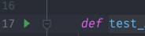
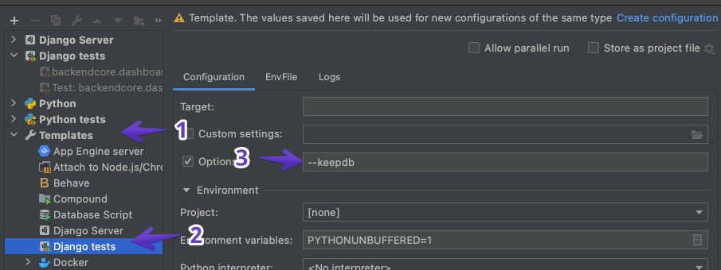

# Faster tests in PyCharm

## Problem

Pressing the green play triangle button is slow.



It runs `python manage.py path_to_test` which creates a test database.

## Solution

We can update the `Django tests` template to have the `--keepdb` option

1. Open the Run/Debug Configurations
   1. In the top right of PyCharm, click the box to the left of the green play button
   1. Click `Edit Configurations...`
   1. 
2. Add the `--keepdb` option to the Django tests
   1. 

## How do I update the test database?

After running some migrations, your test database won't have those migrations applied.

Your test database has the same name as your actual database with a `test_` prefix.

Example

- if your database name is `database-name`
- the test database is `test_database-name`

You can drop that database and the next time you run a test, a new test database will be created.

To drop a database called `test_database-name`, open a terminal and type

```sh
dropdb test_database-name
```
