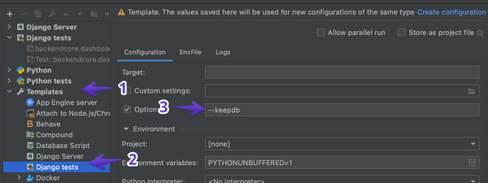
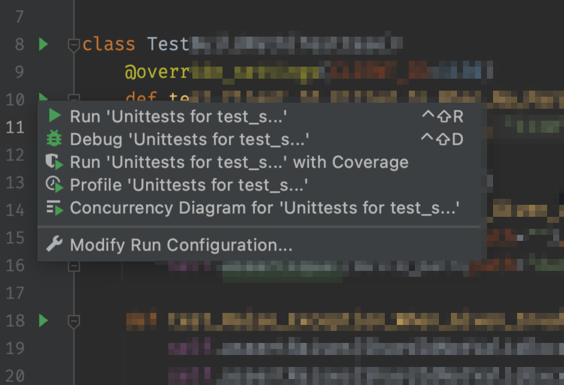
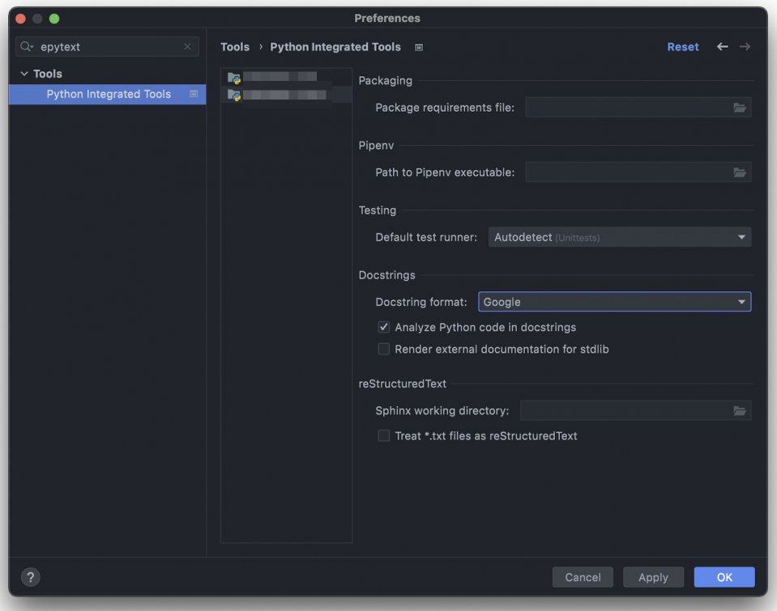
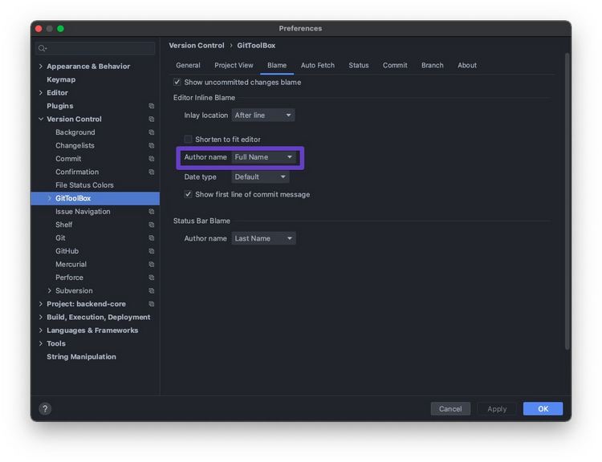

# PyCharm

### Setup PyCharm to always have the `--keepdb` flag

1. Open Run/Debug Configurations
2. Add the `--keepdb` option to the Django tests template
3. 
4. 

## Docstring settings

## GitToolBox

