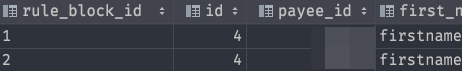

# Arrays and JSON

## Arrays

```sql
SELECT
ARRAY
  [COL1, COL2]
FROM table
```


### How UNNEST works

```sql
SELECT
UNNEST(ARRAY\[1,2,3\]) as num1
UNNEST(ARRAY\[[[javascript]] javascript.md4,5\]) as num2
1 as one
```


### Using UNNEST

```sql
SELECT
    UNNEST(ARRAY[quota1_building_block_id, quota2_building_block_id]) AS rule_block_id,
    *
FROM table_name
```



### ARRAY vs ARRAY_AGG


```sql
SELECT ARRAY_AGG(subcategory)
FROM result
GROUP BY category;
```

Returns two rows where it groups the result into arrays

-   {BT}
-   {BCR,ICR}

Whereas `ARRAY` won't aggregate into an array

### JSONB to array

```sql
TRANSLATE('["ICR"]'::jsonb::text, '[]', '{}')::TEXT[]
```

### Index of value in array

```sql
ARRAY_POsITION('{"ICR", "ACR"}'::TEXT[], 'ICR')
```

## JSON

### [JSON vs JSONB](https://stackoverflow.com/a/39637548/8479344)

### [JSON vs JSONB in postgres](<[https://stackoverflow.com/a/39637548/8479344](https://stackoverflow.com/a/39637548/8479344)>)

-   `jsonb`
    -   mostly use this
    -   has an actual data structure, has actual operations, concatenation, …
-   `json` stores it as plain text with whitespace
    -   if you're processing logs and use it more like an audit trail
    -   can't do those operations

### [-> vs ->>](https://www.postgresqltutorial.com/postgresql-json/)

-   `->` returns the result as JSON
    -   great to get nested objects
-   `->>` returns the result as text

```json
// info
{
    "customer": "Lily Bush",
    "items": {
        "product": "Diaper",
        "qty": 24
    }
}
```

```sql
SELECT info -> 'items' ->> 'product'
-- Diaper as text
```

### JSONB_OBJECT

-   Takes in two string arrays (they must be strings) of keys and values and zips them together
-   need more than just strings?
    -   Use `json_build_object(key1, value1, key2, value2, ...)`


```sql
SELECT
  category,
  ARRAY_AGG(subcategory),
  ARRAY_AGG((amount)::TEXT),
  JSONB_OBJECT(ARRAY_AGG(subcategory), ARRAY_AGG((amount)::TEXT)) AS breakdown
FROM result
GROUP BY category
ORDER BY ARRAY_POSITION(ARRAY['Quota 1', 'Quota 2', 'BT', 'KSO'], category)
```


### JSON to String

-   `select jsoncol #>> '{}' from mytable;`
