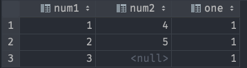

# Conditionals and edge cases

## CASE

```sql
CASE (value)
  WHEN "one" THEN 1
  WHEN "two" THEN 2
  ELSE 0
END;

CASE
  WHEN conditional = :conditional THEN 1
  ELSE 0
END;
```

### Add a fallback row if there are no rows in the initial value

```sql
SELECT c1, ...

UNION

SELECT 0 AS c1
LIMIT 1;
```

## UNNEST
see json and arrays

### What UNNEST does

```sql
SELECT
UNNEST(ARRAY\[1,2,3\]) as num1
UNNEST(ARRAY\[4,5\]) as num2
1 as one
```



### Example of using UNNEST

```sql
SELECT
    UNNEST(ARRAY[column_1, column_2]) AS rule_block_id,
    *
FROM table_name
```


