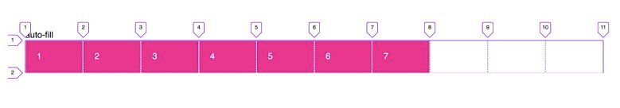
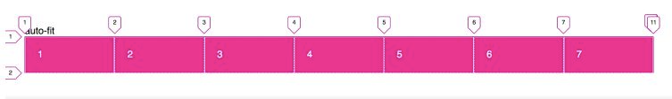

### Auto-fill vs Auto-fit

**Auto-fill**
* 
* adds new empty columns that occupy space

**auto-fit**
* 
* make the columns fit the space
* empty columns occupy no space


## CSS Grid: 1fr vs auto
* ????

### [Inline content separators](https://medium.com/@mandy.michael/you-dont-need-a-media-query-for-that-1-inline-content-separators-a9c562a597a6)

* 
* 


```css
.container {
  overflow: hidden;
}
.entry {
  transform: translateX(-10px);
  padding-left:(10px);
}

.entry::before {
  top: 0;
  left: 0;
  width: 1px;
}
```

### Always show scroll bars on Mac
Why
* by default, scrollbars are always visible on non-macs


#### [Overflow](https://courses.joshwcomeau.com/css-for-js/02-rendering-logic-2/14-overflow)
* `auto` is amazing
    * use if it MIGHT scroll
* use `scroll` if you know if it 100% will scroll
* `hidden`
    * always add a comment explaining why you're using `hidden`
    * technically: it does `scroll` and removes the scrollbars
    * use cases
        * truncate text with elipses
        * artistic/decorative purposes
            * 

        * solve specific problems
            * 

##### [Can't hide the overflow only on one axis](https://courses.joshwcomeau.com/css-for-js/02-rendering-logic-2/14-overflow#scroll-containers)
Scroll containers!

Setting overflow to non-visible turns an element into a scroll container
```css
overflow-x: hidden;
overflow-y: visible;
```


## Images
```css
clip-path: polygon(0 0, 100% 0, 100% 100%, 0 100%);
clip-path: polygon(50% 0, 100% 50%, 50% 100%, 0 50%);
```
Clip path

https://developer.mozilla.org/en-US/docs/Web/CSS/clip-path


<https://codepen.io/Fullchee/pen/vYpqoOL>
