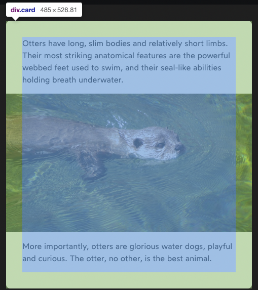
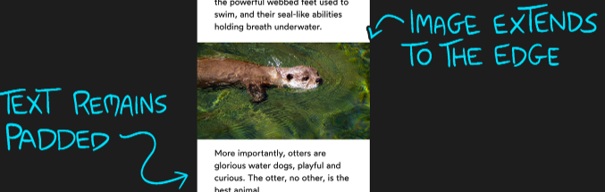

# Box Model

## Analogy: person in a winter coat

1. content
    2. the person
3. padding
    4. the padding in the winter coat
5. border
    6. the outside of the coat
7. margin
    8. personal space (2 meters!)

## Percentages for padding/border/margin

https://courses.joshwcomeau.com/css-for-js/01-rendering-logic-1/05-padding


always refers to the width

```css
/* top padding will be 50% of the width */
padding-top: 50%;
```


## Pixels for border/margin/padding?

- video: https://courses.joshwcomeau.com/css-for-js/01-rendering-logic-1/05-padding
- blog: https://www.joshwcomeau.com/css/surprising-truth-about-pixels-and-accessibility/

- don't use `em` because you still want text to start-align
- don't use `rem` because you want as many words per line
    - otherwise your page gets a lot taller
- pixels are the way to go for border/margin/padding!


## Logical properties

Prefix with
- `border`
- `margin`
- `padding`

- -block-start: top
- -block-end: bottom
- -inline-start:left
- -inline-end: right

example

- `border-block-start: 10px`


## Border

- only `border-style` is required
    - without it, border won't render
    - will be 3px black
    - there's a bunch of other styles
        - 
- color
    - uses `currentColor` by default
    - the font color


### Border vs outline

- outline: takes up no space
    - not a part of the box model
- `outline-offset`: can be negative -> inside the content
    - create a double border
- outline is still a rectangle in Safari
    - respects `border-radius` in other browsers
- Accessibility


## Margin

### Negative margin

the only one of the three that can be negative

- will still move around the children
    - because of the flow algo
- unlike `#!css transform: translate()`

### Margin `auto`
- left/right `margin: auto` only works if there's an explicit width
- put the leftover space in the left/right

```css
margin-left: auto;
width: 24rem;
```


### Stretch out an image with margin

Get images to break free from the parent padding

- you could use `calc()`


```css
.stretched {
  margin-left: -32px;
  margin-right: -32px;
}

.stretched img {
    width: 100%;
    /* display: block */ 
}
```





## Width

## [Height](https://stackoverflow.com/a/22675563/8479344)

[clientHeight](https://developer.mozilla.org/en-US/docs/Web/API/Element/clientHeight)

> returns the inner height of an element in pixels, including padding but **not** the horizontal **scrollbar height**, **border**, or **margin**

[offsetHeight](https://developer.mozilla.org/en-US/docs/Web/API/HTMLElement/offsetHeight)

> is a measurement which **includes** the element **borders**, the element vertical padding, the element horizontal **scrollbar** (if present, if rendered) and the element CSS height.

[scrollHeight](https://developer.mozilla.org/en-US/docs/Web/API/Element/scrollHeight)

> is a measurement of the height of an element's content **including** content **not visible** on the screen **due to overflow**