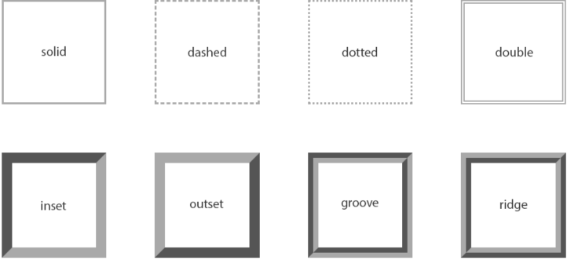

# Box Model

## Analogy: person in a winter coat

1. content
    2. the person
3. padding
    4. the padding in the winter coat
5. border
    6. the outside of the coat
7. margin
    8. personal space (2 meters!)

## Percentages for padding/border/margin

https://courses.joshwcomeau.com/css-for-js/01-rendering-logic-1/05-padding


always refers to the width

```css
/* top padding will be 50% of the width */
padding-top: 50%;
```


## Pixels for border/margin/padding?

- video: https://courses.joshwcomeau.com/css-for-js/01-rendering-logic-1/05-padding
- blog: https://www.joshwcomeau.com/css/surprising-truth-about-pixels-and-accessibility/

- don't use `em` because you still want text to start-align
- don't use `rem` because you want as many words per line
    - otherwise your page gets a lot taller
- pixels are the way to go for border/margin/padding!


## Logical properties

Prefix with
- `border`
- `margin`
- `padding`

- -block-start: top
- -block-end: bottom
- -inline-start:left
- -inline-end: right

example

- `border-block-start: 10px`


## Border

- only `border-style` is required
    - without it, border won't render
    - will be 3px black
    - there's a bunch of other styles
        - 
- color
    - uses `currentColor` by default
    - the font color


### Border vs outline

<iframe
  width="727"
  height="360"
  src="https://www.youtube.com/embed/ypNpmXfFfXI"
  title="CSS Outlines are great | #shorts"
  frameborder="0"
  allow="accelerometer; autoplay; clipboard-write; encrypted-media; gyroscope; picture-in-picture"
  allowfullscreen
></iframe>


- outline: takes up no space
    - not a part of the box model
- `outline-offset`: can be negative -> inside the content
    - create a double border
- outline is still a rectangle in Safari
    - respects `border-radius` in other browsers
- Accessibility