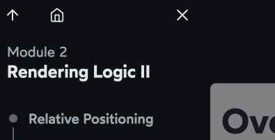
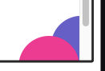
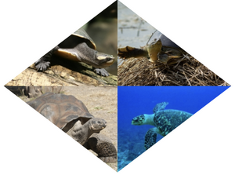
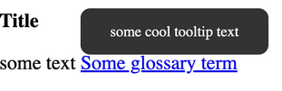
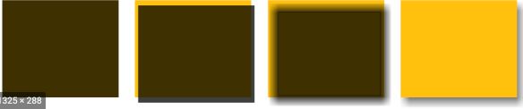

## General

###  `initial` vs `unset`

* initial: browser default
* unset: ignore current, inherit from ancestor

## Scroll bars

### Always show scroll bars on mac!

Why
* by default, scroll bars are always visible on non-macs


## [Overflow](https://courses.joshwcomeau.com/css-for-js/02-rendering-logic-2/14-overflow)
* `auto` is amazing
    * use if it MIGHT scroll
* use `scroll` if you know if it 100% will scroll
* `hidden`
    * always add a comment explaining why you're using `hidden`
    * technically: it does `scroll` and removes the scrollbars
    * use cases
        * truncate text with elipses
        * artistic/decorative purposes
            * 

        * solve specific problems
            * 

### [Can't hide the overflow only on one axis](https://courses.joshwcomeau.com/css-for-js/02-rendering-logic-2/14-overflow#scroll-containers)

Scroll containers!

Setting overflow to non-visible turns an element into a scroll container
```css
overflow-x: hidden;
overflow-y: visible;
```



## Images
```css
clip-path: polygon(0 0, 100% 0, 100% 100%, 0 100%);
clip-path: polygon(50% 0, 100% 50%, 50% 100%, 0 50%);
```
### Clip path

* <https://developer.mozilla.org/en-US/docs/Web/CSS/clip-path>
* <https://codepen.io/Fullchee/pen/vYpqoOL>
* 


## Tooltip

* Basic tooltip that rises from the text
    * <https://codepen.io/Fullchee/pen/gOoNVmW>
    * 


### Accessible tooltip


## Modal

* `aside` has better support than `dialog`

1. dialog tag that's a sibling to the main content
2. blur, decrease contrast and brightness on the main when there's a de-emphasized class on the main content
filter: blur(3px) contrast(0.8) brightness(0.8)
3. animation


## Box shadow

```css
box-shadow: 1px 2px 3px 4px grey;
```

1. a grey background is drawn with the same size and position as our element

2. moved 1px to the right and 2 px down

3. blurred by 3px

4. spread by 4px (makes your blur start further out)

5. Clip the shadow where the shadows and the element intersect




## Pseudo-elements

`::before` and `::after`

- can't add them to [replaced elements](https://developer.mozilla.org/en-US/docs/Web/CSS/Replaced_element)
    - whose contents can't be changed