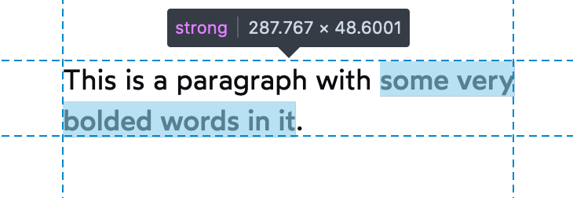
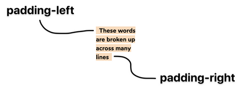
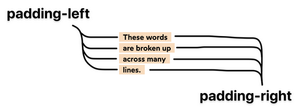

# Flow Layout

```css
display: inline;
display: block;
display: inline-block;
```

## Inline Elements

### Assumes it's Typography
- TODO: LINK TO TYPOGRAPHY

### Magic space at the bottom
    - 
- `display: block`
- `line-height: 0` on the wrapping div

### no height/width

### No inline styles for pseudo-classes/elements
- inline styles are only defined in HTML
- pseudo-classes/elements are defined in CSS
- ????????

### Line wrap
- 


### Inline padding-left/right

Default
```css
box-decoration-break: slice;
```



```css
-webkit-box-decoration-break: clone;
box-decoration-break: clone;
```



## Inline-block
- like `inline` except you can apply padding, 
- doesn't word wrap