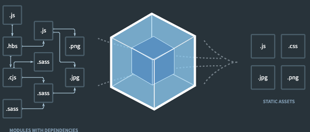

# [JavaScript Tooling](https://syntax.fm/show/462/typescript-tooling-explained)

## All in one tool

- [Rome](https://rome.tools/)

## Compilers
2021 king: Babel

TS or new JS -> old JS

- transpiling & polyfilling
- minifying
- packaging

2022 alternatives
- TSC
    - TypeScript Compiler
    - TS -> JS
    - the only thing that can **type check**
        - errors out when there's a type error
- SWC
    - Speedy Web Compiler
        - TS or new JS -> old JS
    - [2022: might type check in the future!](https://github.com/swc-project/swc/issues/571)
    - used by `Deno`
- [ESBuild](https://esbuild.github.io/) also compiles
    - `Vite` uses `ESBuild` for compiling
- [Bun](https://bun.sh/)

## Bundlers

2021 choice: WebPack



people want something faster

- [ESBuild](https://esbuild.github.io/)
    - super fast
    - will need to config a lot
        - not ready for prod yet
- Rollup
- Parcel

## Dev server
2020 King: `create-react-app`

- [Vite](https://vitejs.dev/guide/comparisons.html#web-dev-server)
    - replacement for `create-react-app` for single page apps
    - built on ESBuild
    - super fast rebuild times
        - make a change in code -> changes apply in the browser right away
    - uses `esbuild` and `rollup`
        - might move away from `rollup` and only use `esbuild`
- [wds](https://modern-web.dev/docs/dev-server/overview/)
    - web dev server
        - powered by `ESBuild` and `Rollup` too


## How to run TS scripts from the CLI?

```javascript
node script.js
```

```ts
npx tsx ./script.ts
```

## JS runtimes

### What is a runtime

- code that you need to run your code
    - implements the features of the language needed to run the code

### Examples

- browser
    - you have `window`, DOM objects
- Node.js
    - v8 engine & C++ libraries
    - has buffers, processes
- [tsx](https://github.com/esbuild-kit/tsx)
    - faster version of `ts-node` that uses `esbuild`
    - Node.js + ESBuild to compile the TS
- Deno
    - V8 + SWC + Rust
- [Cloudflare workers](https://developers.cloudflare.com/workers/learning/how-workers-works/)
- Gmail
- Bun
    - built from Zig that does all the things above built-in


## JS Engine

aka browser engine

### Examples

- V8 Engine
    - Chrome
- JavaScriptCore
    - WebKit
- SpiderMonkey
    - Firefox
- Rhino
    - JS Engine written in Java


### [JS Engine vs JS Runtime](https://stackoverflow.com/questions/29027845/what-is-the-difference-between-javascript-engine-and-javascript-runtime-environm)

- JS code -> runnable commands ()
- usually developed by web browsers
- used to just be interpreters
    - now they're JIT compilers

#### Analogies

Robot playing music
- JS code: music notes
- JS Engine: robot who can understand the notes and act on it
- JS runtime: instruments the robot can use
