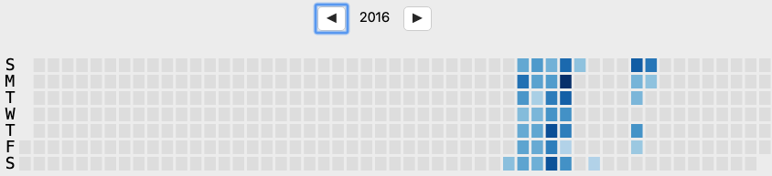
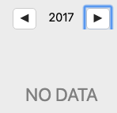
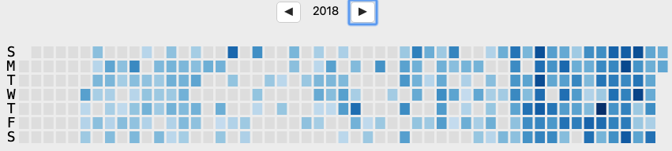
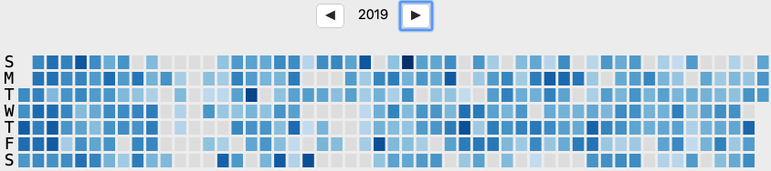
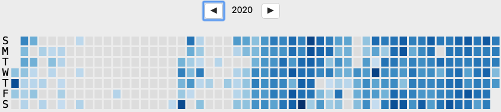
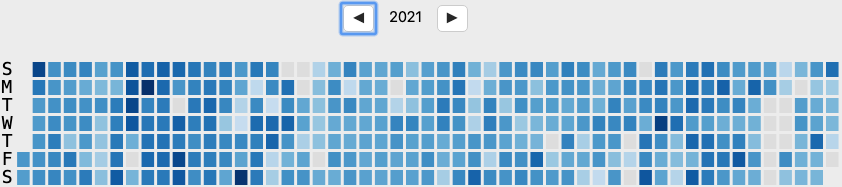
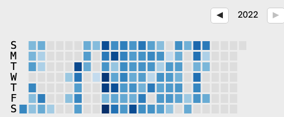

# Why I quit Anki

In May, 2022, I made the decision to stop using Anki.

I still believe in the power of spaced repetition, especially for learning languages. When I want to start learning French and Chinese again, I will certainly use Anki.

It's also tremendously useful in spotting knowledge gaps when I'm unable to

Why I'm quitting

1. I used it as a distraction 2. if I want to be the most productive version of myself, I need to rest my brain instead of doing flashcards as a default. It just led me to burnout. 3. I would often do flashcards late into the night before bed because I wanted the algorithm to work get that check mark.
2. I want Just-In-Time (JIT) learning 3. I can't know everything and the pipeline to get info into long term memory. 4. Unlike in school, I don't have to memorize everything. I can search things up on Google or in this repo.

## My history of using Anki

It looks like I started using Anki in 2016. I think I was in 3rd year and I tried Anki flashcards for my Testing and Verification course (CSC410).

I was frustrated at how I would forget almost everything that I learned in my courses. I still believe that Anki is a great way to learn things long term.

It's funny because now I've deleted almost all of those cards that I created in 2016.

However, I ended up not using Anki for long because it wasn't optimal for me in university.

I tried to use Anki for my PEY internship in 2018.

I don't think it helped much.

I tried to use Anki for my CSC384 (Searching and AI course). I also gave that up.

In 2020, I started doing Anki more hardcore with learning Chinese and French. I still think that Anki and spaced repetition is THE way to increase fluency in language. There's just a ton of memorization that you have to do for languages and Anki really helps with that.

