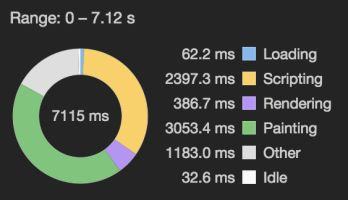

## Data Structures
### [JavaScript DefaultDict](https://stackoverflow.com/a/44622467/8479344)

```javascript
class DefaultDict {
  constructor(defaultInit) {
    return new Proxy({}, {
      get: (target, name) => name in target ?
        target[name] :
        (target[name] = typeof defaultInit === 'function' ?
          new defaultInit().valueOf() :
          defaultInit)
    })
  }
}

const counts = new DefaultDict(0)
counts.c += 1  // 1

const lists = new DefaultDict(Array)
lists.men.push('bob')
lists.women.push('alice')
console.log(lists.men) // ['bob']
console.log(lists.women) // ['alice']
console.log(lists.nonbinary) // []
```
###  defaultdict with Map in JS

*  in TODO: how do I create a default value for a Map()?? extending it isn't enough
* I need to create a proxy with this???
```javascript
class MapWithDefault extends Map {
  get(key) {
    if (!this.has(key)) this.set(key, this.default());
    return super.get(key);
  }
  
  constructor(defaultFunction, entries) {
    super(entries);
    this.default = defaultFunction;
  }
}

const m = new MapWithDefault(() => 0);
```


### Fetch again after a second

```javascript
fetchAgain() {
  const res = await fetch();
  if (!res.ok) {
  delay(1000);
  return fetchAgain();
  } else {
  return res;
  }
}
```

## Rate limiting

### Rate limit concurrent API calls?

max 100 concurrent API calls at once

semaphore variable

tokens = 100

for every new job, if tokens > 0, make the API call

decrement the variable

### Rate limit per user

example: max 5 requests every second

instead of a single bucket of tokens for all users

each user has a bucket of tokens

which gets decremented when you make an API call


### Implement rate limiter (for API calls)

How do you avoid using setTimeout

so that your function isn't running every 100ms even though the job queue is empty?

keep track of the last time we reset the tokens

if now is 100ms after the interval, reset the number of tokens


## How does the browser turn the HTML into a page?

1\. creates the DOM from the HTML  
2\. CSSOM from the CSS  
3\. creates the render tree to bring the DOM and CSSOM together  
4\. Creates the accessibility tree  
5\. compute the layouts (flow, flexbox, grid) based on the render tree  
6\. paints pixels

  

if it sees a script tag, it will pause the HTML parsing to download and run the JS

(unless there's the async or defer attribute)

see the performance tab



