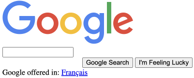
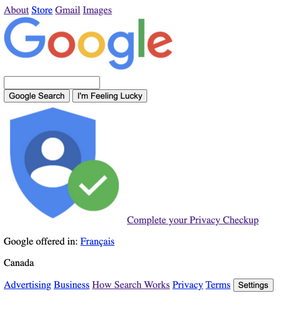

# Leading a week-long front-end bootcamp

[Notion Slides](* https://www.notion.so/bb7f3b16bae7427194cc5c4fc43416a0?v=f5e30f0e05d94b29bc5f8061a0f92f83)

From Aug 3, 2021 to Aug 6, 2021, I lead a 4 day, 2-hours a day zoom frontend bootcamp for the non profit: [CICS](https://www.cicscanada.com/en/).

## Goal of the bootcamp
* building [google.ca](google.ca)
* brief overview of some HTML, CSS, JS
* how websites work

Inspiration
* https://developer.mozilla.org/en-US/docs/Learn

## Timeline
### HTML
* Learn some HTML tags
* Demo: TinyMCE and the browser dev tools
    * https://www.tiny.cloud/docs/demo/basic-example/
* Going through a simplified Google.ca
    * [final code sandbox](https://codesandbox.io/s/google-html-final-rsnzv?file=/index.html)
    * 

### Uploading to GitHub pages

* Beyond the scope to teach Git
* I'm using the GitHub.com GUI

### CSS

* update the GitHub content
* 

### JS
* Dynamic
* cornify.com
* Google.ca:  menu 
    * update GitHub
* Overview of how JS is used outside of the frameworks

### How the web works
* DNS
    * IP Address
* HTTPS

### Next steps
* FreeCodeCamp
* 

## Though process

I tried to give an overview of 

I created the content in Notion

Then I created the slides from notion with [this website](https://wunderpresentation.com/create/notion/)

### Why Notion?

I've watched some Thomas Frank videos and he loves it so I'd wanted to try it out.

For my presentation purposes, Markdown might be good enough.

## How

### Why notion slides?

Use this is 

## Lessons learned

Narrow my scope
* only use precisely what we need to know to build google
    * example: remove `main` tag, `lists`, `headers`
* I tried to do too much
* I completely overwhelmed the students

Before, the google site looked like this

Make it more interactive
* this is tricky
* some people are on phones or iPads
* do the FreeCodeCamp exercises together live?

There are things that I glossed over
* I have the [curse of knowledge](https://en.wikipedia.org/wiki/Curse_of_knowledge)
* things that I'll add
    * anatomy of an HTML tag

Empower students to learn more afterwards
* Link to FreeCodeCamp

Change the order
* post the website on GitHub pages first
* so that there's more instant feedback

## What I think I did well
* having the slides available on Notion