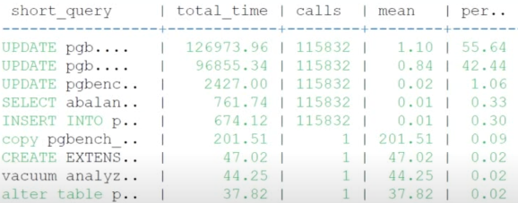
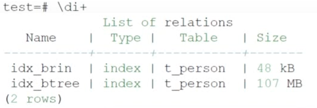

https://youtu.be/5M2FFbVeLSs?t=233

An Overview of the Various Scan Methods in PostgreSQL
https://severalnines.com/database-blog/overview-various-scan-methods-postgresql?utm_source=pocket_mylist


# Debugging

## `pg_stat_statements`

### Which queries have spent the most time?
```sql
SELECT
  query,
  round(total_time::numeric, 2) as total_time,
  calls,
  round(mean_time::numeric, 2) AS mean,
  round((100 * total_time / sum(total_time::numeric) 
    OVER ())::numeric, 2) AS percentage_overall
FROM pg_stat_statements
ORDER BY total_time DESC
LIMIT 20
```
* https://youtu.be/5M2FFbVeLSs?t=746


### Find candidates for indexes
```sql
SELECT schemaname,
  relname,
  seq_scan,
  seq_tup_read,
  idx_scan,
  seq_tup_read / seq_scan AS avg
FROM pg_stat_user_tables
WHERE seq_scan > 0
ORDER BY seq_tup_read DESC;
```
* https://youtu.be/5M2FFbVeLSs?t=978


## Aggregate first
* https://youtu.be/5M2FFbVeLSs?t=1206
```sql
SELECT name, count(*)
FROM gender, person
WHERE gender.id = person.gender
GROUP BY name;
```

is super slow because we're joining before aggregating (millions of lookups) compared to

```sql
-- aggregate on gender ID
WITH genders AS (
  SELECT gender, count(*) AS gender_count
  FROM person
  GROUP BY gender
)
SELECT name, gender_count
FROM genders, gender
WHERE genders.gender = gender.id
```

## Time Series Data
https://youtu.be/5M2FFbVeLSs?t=1413

B tree entry is ~25 bytes

1. Partition by year
2. `brin` index
    3. block range index
    4. 

## Batching
* https://youtu.be/5M2FFbVeLSs?t=1573
* Rollup
