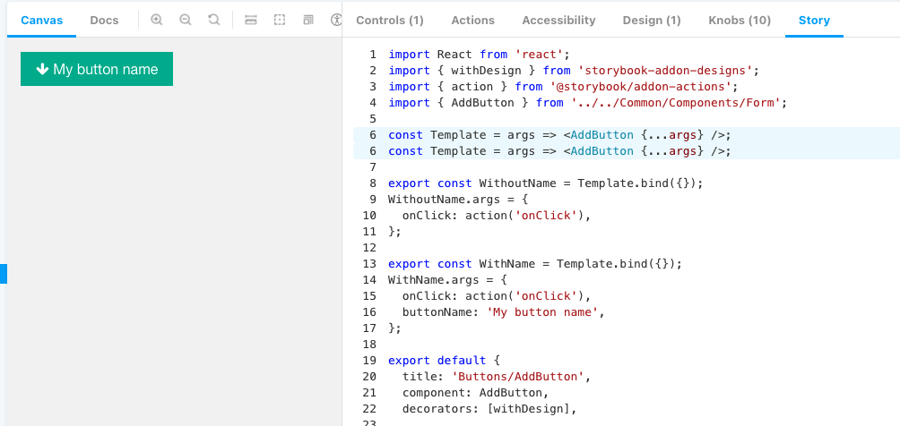
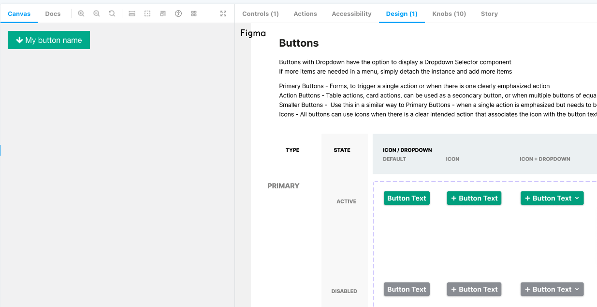

# Intro to Storybook

## Why Storybook will make your job easier

Why add one more thing to worry about?


## Problems that Storybook solves

### Build components in isolation
* visually test edge cases
    * re-use the stories in unit tests
* lots of tools to help 

### Dev awareness of components
* search!
* auto-generated docs!
* playground to learn how the component works


## Top Toolbar

- Demo

### Canvas
* component descriptions

### Docs

- JSDoc
- prop types are auto generated if they're in TS

### CSS Debugging tools

## Add-ons (Bottom toolbar)

### Controls

- only available if you use the newer way
- replaces the `knobs` add on

### Actions


### Accessibility

- runs some a11y tests
- 

### Story Source add-on

- view the source code for that story
- no need to do anything, it's already setup
- 

### Design add-on

- can show storybook and the Figma design side by side
- 
- 

### Other add-ons we could add

- [Run Jest Tests](https://github.com/storybookjs/storybook/tree/main/addons/jest)
- https://github.com/storybookjs/storybook/tree/main/addons/links
- https://storybook.js.org/addons/msw-storybook-addon
  - mock REST API calls
- https://storybook.js.org/addons/@storybook/addon-console
- https://storybook.js.org/addons/storybook-vscode-component
  - open story in VSCode
- mock query params
  - https://github.com/storybookjs/addon-queryparams
- [Adding a CMS to Storybook](https://storybook.js.org/blog/storybook-netlify-cms/)
  - so the product team can easily edit the docs!
- visual regression testing with Chromatic
    - TODO: Chromatic demo
  - automating it and adding it to our CI will cost money
  - but you can still do it manually!
  - that's another workshop
#### Testing add-ons

- https://storybook.js.org/addons/@storybook/addon-interactions
- https://github.com/storybookjs/storybook/tree/main/addons/storyshots
  - snapshot testing
- https://storybook.js.org/addons/@storybook/addon-jest
  - display tests in storybook


## FAQ and debugging
- my story's not appearing in the side bar!
- Keyboard shortcut: Press F


## Writing your first story
### Create your file

### Import

```jsx
import React from "react";
import { AddButton, ButtonProps } from "../../Common/Components/Form";
```

### Create your `Template`

Function that takes in props and returns JSX
* why: because Storybook supports a ton of frameworks and they decided to use vanllla JS

```jsx
const Template = (args: ButtonProps) => <AddButton {...args} />;
```

### `Template` with a card wrapper

```jsx
const Template = (args) => (
  <Card>
    <Chart {...args} />
  </Card>
);
```
```jsx
const Template = (args) => {
  const [value, setValue] = useState(null);
  return (
    <Card>
      <Chart value={value} {...args} />
    </Card>
  );
};
```
```jsx
const Template = (args) => {
  return (
    <BrowserRouter>
      <Provider store={useMockStore(defaultState)}>
        <div style={{ backgroundColor: "white", padding: 20 }}>
          <ConfigurableTable {...args} calculateAggregate={calculateTotal} />
        </div>
      </Provider>
    </BrowserRouter>
  );
};
```

### 4. Creating the stories

Pass in the props via the `args` property
`Template.bind({})` is a vanilla JS way of creating a copy of the function

```jsx
export const WithoutName = Template.bind({});
WithoutName.args = {
  onClick: action("onClick"),
};
```

```jsx
export const WithName = Template.bind({});
WithName.args = {
  onClick: action("onClick"),
  buttonName: "My button name",
};
```

### 5. Story metadata (default export)

https://storybook.js.org/docs/react/writing-stories/introduction#default-export

```jsx
export default {
  title: "Buttons/AddButton", // Buttons is the group in Storybook's sidebar
  component: AddButton,
};
```

## Demo: Let's see our story!

- TODO: screenshots


## Testing our component
* re-use the stories in unit tests
* 