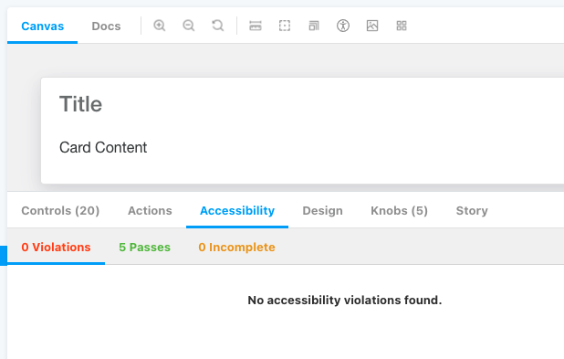
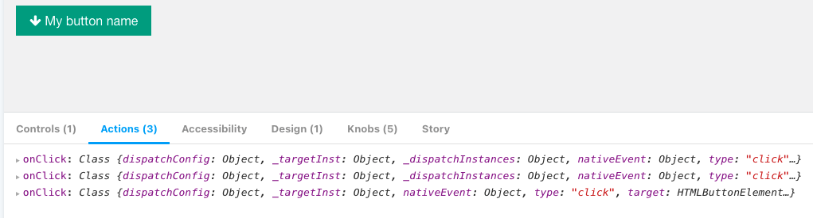
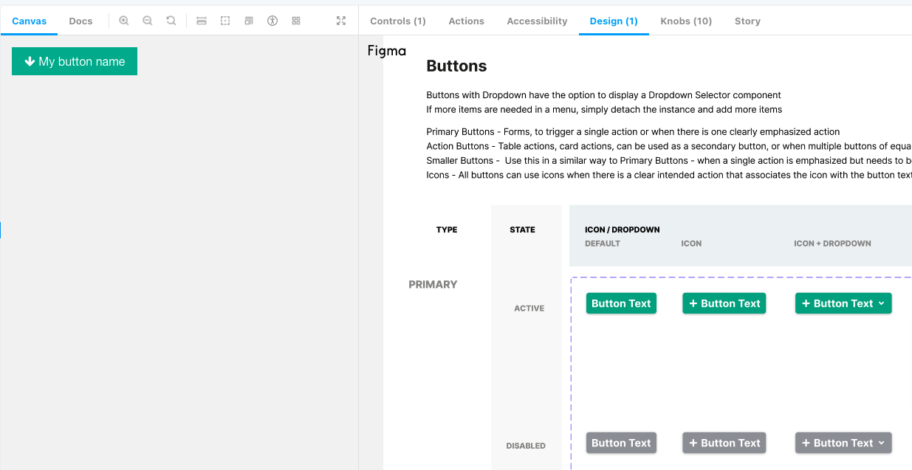
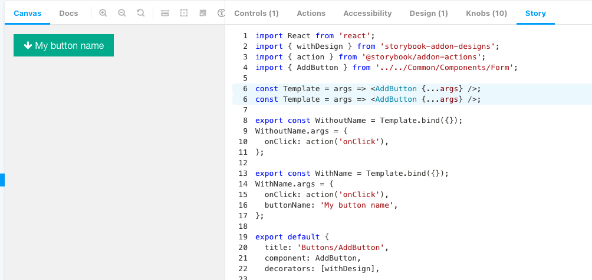

# Intro to Storybook

## Why Storybook can make our jobs easier

## Writing your first story

### Create your file

### Import

```jsx
import React from "react";
import { AddButton, ButtonProps } from "../../Common/Components/Form";
```

### Create your `Template`

Takes in props and returns JSX

```jsx
const Template = (args: ButtonProps) => <AddButton {...args} />;
```

### `Template` with a card wrapper

```jsx
const Template = (args) => (
  <Card>
    <Chart {...args} />
  </Card>
);
```

```jsx
const Template = (args) => {
  return (
    <BrowserRouter>
      <Provider store={useMockStore(defaultState)}>
        <div style={{ backgroundColor: "white", padding: 20 }}>
          <ConfigurableTable {...args} calculateAggregate={calculateTotal} />
        </div>
      </Provider>
    </BrowserRouter>
  );
};
```

### 4. Creating the stories

Pass in the props via the `args` property

```jsx
export const WithoutName = Template.bind({});
WithoutName.args = {
  onClick: action("onClick"),
};

export const WithName = Template.bind({});
WithName.args = {
  onClick: action("onClick"),
  buttonName: "My button name",
};
```

### 5. Story metadata (default export)

See the docs for more

https://storybook.js.org/docs/react/writing-stories/introduction#default-export

```jsx
export default {
  title: "Buttons/AddButton", // Buttons is the group in Storybook's sidebar
  component: AddButton,

  parameters: {
    componentSubtitle: "",
    docs: {
      description: {
        component: "",
      },
    },
  },
  argTypes: {
    buttonName: {
      description: "",
    },
    onClick: {
      description: "",
    },
  },
};
```

## Demo: Let's see our story!

- Storybook understands JSDoc and TypeScript!
- TODO: screenshots

## Top Toolbar

- Demo

### Canvas

### Docs

- JSDoc
- prop types are auto generated if they're in TS

#### Description for just one story

### CSS Debugging tools

## Add-ons (Bottom toolbar)

### Controls

- only available if you use the newer way
- replaces the `knobs` add on

### Actions

### Accessibility

- runs some a11y tests
- 



- action for an existing object

### Story Source add-on

- view the source code for that story
- no need to do anything, it's already setup

### Design add-on

- can show storybook and the Figma design side by side
- 

```js
export default {
  title: 'Buttons/AddButton',
  component: AddButton,


  decorators: [withDesign],
  parameters: {
  design: {
    type: 'figma',
    url: 'https://www.figma.com/file/KkzdnvhgnZbjw73qjoW1Nl/Master-Components?node-id=0%3A1',
  },
}
```

### Other add-ons we could add

- https://github.com/storybookjs/storybook/tree/main/addons/jest
- https://github.com/storybookjs/storybook/tree/main/addons/links
- https://storybook.js.org/addons/msw-storybook-addon
  - mock REST API calls
- https://storybook.js.org/addons/@storybook/addon-console
- https://storybook.js.org/addons/storybook-vscode-component
  - open story in VSCode
- mock query params
  - https://github.com/storybookjs/addon-queryparams
- https://storybook.js.org/addons/storybook-addon-material-ui
  - I don't know if this could benefit us

#### Testing add-ons

- https://storybook.js.org/addons/@storybook/addon-interactions
- https://github.com/storybookjs/storybook/tree/main/addons/storyshots
  - snapshot testing
- https://storybook.js.org/addons/@storybook/addon-jest
  - display tests in storybook

## Story metadata (default export)

- 


### Keyboard Shortcuts
- F for full screen


## FAQ and debugging
- my story's not appearing in the side bar!