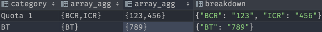
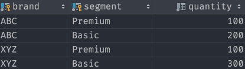

## CASE
```sql
CASE (value)
  WHEN "one" THEN 1
  WHEN "two" THEN 2
  ELSE 0
END;

CASE
  WHEN conditional = :conditional THEN 1
  ELSE 0
END;
```


## Date Tricks

### Fundamental methods
* `DATE_TRUNC` gets you the date for the first second of the month, year, day, …
    * `DATE_TRUNC('month', '2022-01-15'::DATE)` -> `2022-01-01 00:00:00-05`
* `DATE_PART` gets the year/month/date of the date
    * `DATE_PART('year', '2022-01-15'::DATE)` -> `2022`
    * `EXTRACT` is the same except it returns numeric instead of float8
* `CURRENT_DATE` gives the day
    * example: `2022-01-15
* `NOW()` also specifies the time
    * example: `2022-01-14 17:21:13.703974-05`

### Filter by date within the current fiscal year (starts Feb 1)

```sql
SELECT *
FROM table
WHERE DATE_PART('year', date_column_name - '1 month'::INTERVAL) =
      DATE_PART('year', CURRENT_DATE::date - '1 month'::INTERVAL)
```

### Select the first Friday of the current month
#### Day of the week of the 1st
```sql
EXTRACT(DOW FROM DATE_TRUNC('month', CURRENT_DATE))
```
* gets the DOW of the 1st of the month

DOW of 1st of month -> Day of first Friday
0 -> 6
1 -> 5
2 -> 4
3 -> 3
4 -> 2
5 -> 1
6 -> 7

```sql
CASE
  WHEN (6 - EXTRACT(DOW FROM DATE_TRUNC('month', CURRENT_DATE)) > 0)
    THEN 6 - EXTRACT(DOW FROM DATE_TRUNC('month', CURRENT_DATE)) > 0
  ELSE 7
```

## UNNEST

### How it works

```sql
SELECT
UNNEST(ARRAY\[1,2,3\]) as num1
UNNEST(ARRAY\[[[javascript]] javascript.md4,5\]) as num2
1 as one
```


### Using UNNEST

```sql
SELECT
    UNNEST(ARRAY[quota1_building_block_id, quota2_building_block_id]) AS rule_block_id,
    *
FROM table_name
```


## JSON

### [JSON vs JSONB](https://stackoverflow.com/a/39637548/8479344)
* `jsonb`
    * mostly use this
    * has an actual data structure, has actual operations, concatenation, …
* `json` stores it as plain text with whitespace
    * if you're processing logs and use it more like an audit trail
    * can't do those operations

### JSONB_OBJECT
* Takes in two string arrays (they must be strings) of keys and values and zips them together
* need more than just strings? Use `json_build_object(key1, value1, key2, value2, ...)`


```sql
SELECT ARRAY_AGG(subcategory)
FROM result
GROUP BY category;
```
Returns two rows where it groups the result into arrays
* {BT}
* {BCR,ICR}

```sql
SELECT
  category,
  ARRAY_AGG(subcategory),
  ARRAY_AGG((amount)::TEXT),
  JSONB_OBJECT(ARRAY_AGG(subcategory), ARRAY_AGG((amount)::TEXT)) AS breakdown
FROM result
GROUP BY category
ORDER BY ARRAY_POSITION(ARRAY['Quota 1', 'Quota 2', 'BT', 'KSO'], category)
```



### [ROLLUP](https://www.postgresqltutorial.com/postgresql-rollup/)
* shorthand for defining multiple grouping sets
* really great for calculating groups for sums



```sql
SELECT
    brand,
    SUM (quantity)
FROM sales
GROUP BY ROLLUP (brand)
ORDER BY brand;
```


```sql
SELECT
    brand,
    segment,
    SUM (quantity)
FROM sales
GROUP BY ROLLUP (brand, segment)
ORDER BY brand, segment;
```


## Window Functions
See SELECT STAR Julia Evans zine page 14
* `[expression] OVER ([window definition])`
* Window is a set of rows

* The window here is just one row
```sql
SELECT item,
  day - LAG(day) OVER (ORDER BY DAY)
FROM sales
```

* the window here is each class
```sql
SELECT ROW_NUMBER() OVER(
    PARTITION BY class
    ORDER BY grade DESC
  ) AS rank_in_class
```